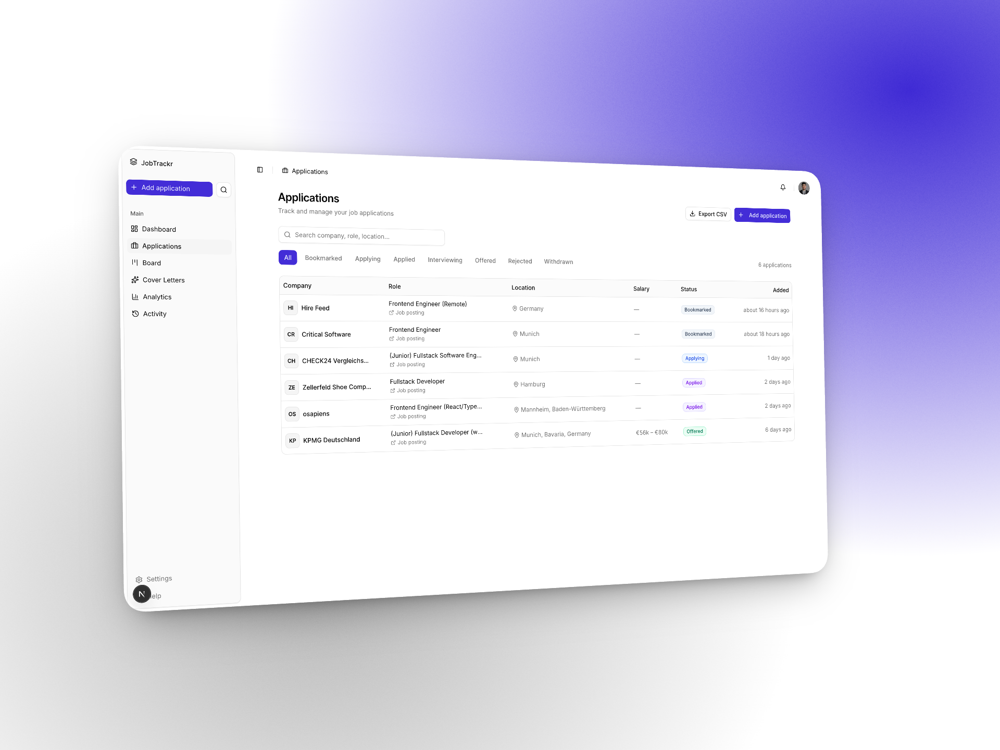
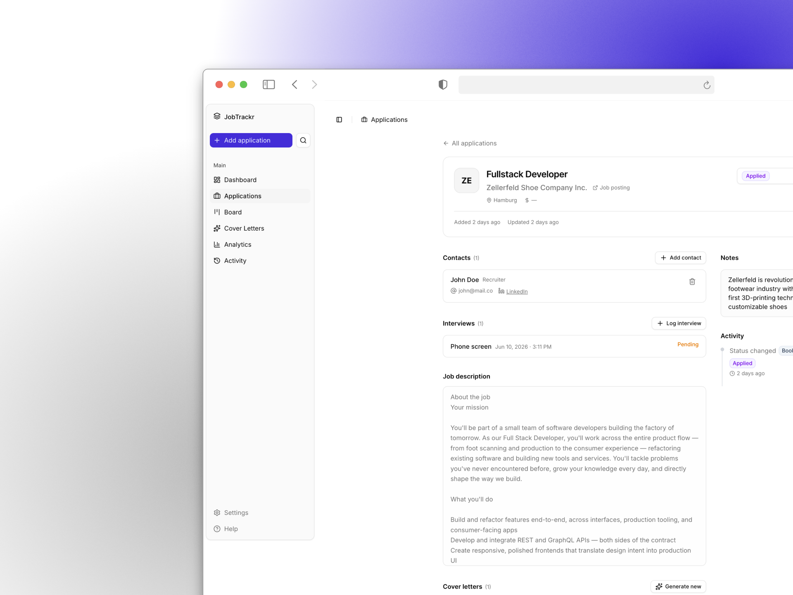

# JobTrackr

JobTrackr is a focused job application tracker built for engineers who want fewer distractions and more clarity while searching for roles. Add every application, keep recruiter and interview details in one place, and use built-in AI tools to speed up repetitive tasks like writing cover letters.

Why it exists: job searching gets messy — bookmarks, spreadsheets, and browser tabs quickly fragment your work. JobTrackr brings everything together so you can focus on the job, not the process.

Highlights
- Centralised application tracking with a clear status pipeline
- Kanban-style board for moving roles through your workflow
- Per-application history (contacts, interviews, timeline)
- AI-powered cover letter generation with streaming output and history
- Analytics and activity logs to see how your pipeline performs

|  |  |
|---:|:---|
|  |  |


## What’s Included

Core features implemented in this repository:

- Application tracking: add company, title, location, salary range, job URL, and full job description.
- Status pipeline: move items through `Bookmarked → Applying → Applied → Interviewing → Offered → Rejected / Withdrawn`.
- Kanban board: drag-and-drop board view to organise applications by stage.
- Application detail: per-application pages with contacts, interview log, notes, and activity timeline.
- Contact tracking: save recruiter and hiring manager information per application.
- Interview log: record every interview with notes and outcomes.
- Cover letter generator: AI-driven generator (streaming responses) and saved generation history.
- Analytics dashboard: basic visualisations of pipeline health and response rates.
- CSV export endpoint for offline analysis.
- GitHub OAuth sign-in (NextAuth) and responsive UI components.

If you explore the codebase you’ll find feature folders under `features/` and page routes under `app/` that map directly to these capabilities.

## Tech Stack

Frontend

- Next.js 16 App Router
- TypeScript
- Tailwind CSS
- shadcn/ui primitives
- TanStack Query for client data fetching

Backend & infra

- Next.js Server Actions for server-side mutations
- PostgreSQL (development targeted for Neon)
- Drizzle ORM for schema and queries
- NextAuth v5 (GitHub OAuth)

AI

- Streaming AI via Vercel AI SDK
- Support for Anthropic (Claude) and OpenWeb/OpenAI backends via config

Tooling

- Drizzle Kit for migrations
- Zod for runtime validation
- ESLint for linting

## Project Structure (quick)

High-level layout — vertical feature-based ordering.

```
app/                 # Next.js app routes and pages (App Router)
components/          # Shared UI and layout components
features/            # Business logic per feature (applications, analytics, cover-letter, etc.)
lib/                 # DB client, helpers
types/               # Type augmentations
```

## Database Schema (summary)

Tables: `users`, `applications`, `contacts`, `interviews`, `cover_letters`, `activity_log`.

- `activity_log` records changes over time and powers analytics.
- `cover_letters` stores prompt context, model metadata, and the generated output.

## Getting Started

Prereqs

- Node.js 18+
- A PostgreSQL database (Neon recommended for convenience)
- GitHub OAuth app (for authentication)
- An Anthrop​ic or OpenAI API key if you want built-in AI features

Quick setup

```bash
git clone https://github.com/maisamaf/application-tracker.git
cd application-tracker
npm install
cp .env.local.example .env.local # or fill .env.local directly
npm run db:push                   # push schema to dev DB
npm run dev
```


## Scripts

```bash
npm run db:push
npm run db:generate
npm run db:migrate
npm run db:studio
npm run dev
```

## Development Roadmap

What’s done (core):

- [x] Database schema + Drizzle setup
- [x] GitHub OAuth with NextAuth v5
- [x] Dashboard layout shell — sidebar, navbar, auth guard
- [x] Applications list — table, filters, search
- [x] Add / edit application form
- [x] Application detail page — contacts, interviews, timeline
- [x] Kanban board view
- [x] AI cover letter generator with streaming
- [x] Analytics dashboard
- [x] CSV export
- [ ] Landing Page

Remaining / future work:

- [ ] Search functionality
- [ ] Keyword extraction
- [ ] Cover Letters Page
- [ ] Settings page
- [ ] End-to-end tests and CI pipeline


## License

MIT