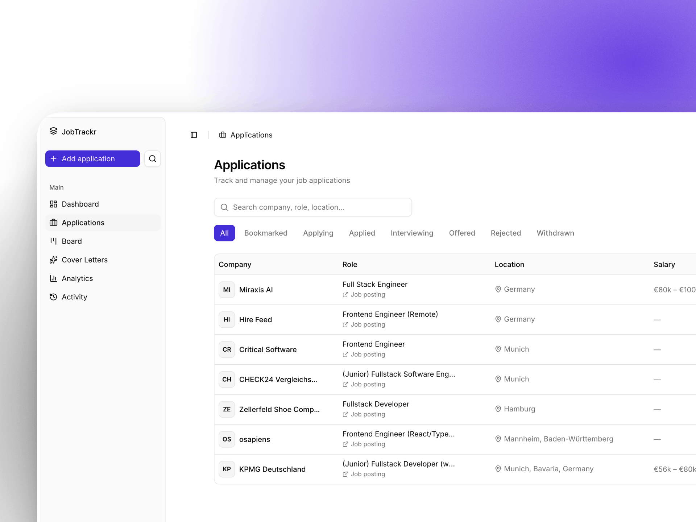
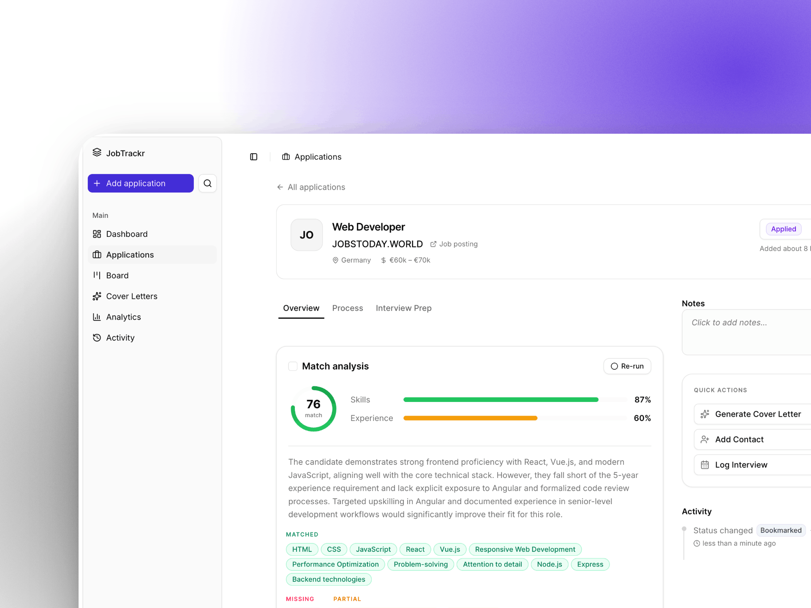

# JobTrackr

JobTrackr is a focused job application tracker built for engineers who want fewer distractions and more clarity while searching for roles. Add every application, keep recruiter and interview details in one place, and use built-in AI tools to speed up repetitive tasks like writing cover letters.

Why it exists: job searching gets messy — bookmarks, spreadsheets, and browser tabs quickly fragment your work. JobTrackr brings everything together so you can focus on the job, not the process.

Highlights
- Centralised application tracking with a clear status pipeline
- Kanban-style board for moving roles through your workflow
- Per-application history (contacts, interviews, timeline)
- AI-powered cover letter generation with streaming output and history
- Analytics and activity logs to see how your pipeline performs

|  |  |
|---:|:---|
|  |  |


## What’s Included

Core features implemented in this repository:

- Application tracking: add company, title, location, salary range, job URL, and full job description.
- Status pipeline: move items through `Bookmarked → Applying → Applied → Interviewing → Offered → Rejected / Withdrawn`.
- Kanban board: drag-and-drop board view to organise applications by stage.
- Application detail: per-application pages with contacts, interview log, notes, and activity timeline.
- Contact tracking: save recruiter and hiring manager information per application.
- Interview log: record every interview with notes and outcomes.
- Cover letter generator: AI-driven generator (streaming responses) and saved generation history.
- Analytics dashboard: basic visualisations of pipeline health and response rates.
- CSV export endpoint for offline analysis.
- Authentication: GitHub OAuth, Google OAuth, and email/password sign-up and sign-in (NextAuth v5) with a branded split-panel auth UI.
- AI Gap Analysis & Match Scoring: Automatic candidate-to-job fit analysis comparing CV skills, experience, and profile against the job posting details. Returns matching, partial, and missing skills with an overall fit score and recommendations.
- AI Interview Prep: Automatically extracts and lists tailored technical, behavioral, role-specific, and culture interview questions with suggested answers.
- Smart Job Ingestion & Scraping: Paste direct job links (LinkedIn, Indeed, etc.) to automatically fetch, scrape, and structure the job details using Jina Reader or fallback Cheerio scrapers.
- Interactive Dashboard Nudges: Real-time dynamic tips based on pipeline analytics to prompt next steps.
- Real-Time Notifications: User notification center with visual alerts and soft audio chimes when background AI processing (like ingestion or gap analysis) completes.
- Settings & AI Configuration Panel: Unified preferences view allowing users to save display name, manage CV profile experience/education lists, choose their preferred AI provider (OpenAI, Anthropic, Gemini, Ollama/OpenWebUI), active models, and customize embedding dimensions.

If you explore the codebase you’ll find feature folders under `features/` and page routes under `app/` that map directly to these capabilities.

## Tech Stack

Frontend

- Next.js 16 App Router
- TypeScript
- Tailwind CSS
- shadcn/ui primitives
- TanStack Query for client data fetching

Backend & infra

- Next.js Server Actions for server-side mutations
- PostgreSQL (development targeted for Neon)
- Drizzle ORM for schema and queries
- NextAuth v5 — GitHub OAuth, Google OAuth, and Credentials (email + scrypt-hashed password)

AI

- Streaming AI via Vercel AI SDK
- Support for Anthropic (Claude) and OpenWeb/OpenAI backends via config

Tooling

- Drizzle Kit for migrations
- Zod for runtime validation
- ESLint for linting

## Project Structure (quick)

High-level layout — vertical feature-based ordering.

```
app/                 # Next.js app routes and pages (App Router)
components/          # Shared UI and layout components
features/            # Business logic per feature (applications, analytics, cover-letter, etc.)
lib/                 # DB client, helpers
types/               # Type augmentations
```

## Database Schema (summary)

Tables: `users`, `applications`, `contacts`, `interviews`, `cover_letters`, `activity_log`.

- `activity_log` records changes over time and powers analytics.
- `cover_letters` stores prompt context, model metadata, and the generated output.

## Getting Started

Prereqs

- Node.js 18+
- A PostgreSQL database (Neon recommended for convenience)
- GitHub OAuth app
- Google OAuth app (Cloud Console → APIs & Services → Credentials)
- An Anthropic, OpenAI or Gemini API key if you want built-in AI features

Quick setup

```bash
git clone https://github.com/maisamaf/job-tracker.git
cd job-tracker
bun install
cp .env.local.example .env.local # or fill .env.local directly
bun run db:push                   # push schema to dev DB
bun run dev
```


## Scripts

```bash
bun run db:push
bun run db:generate
bun run db:migrate
bun run db:studio
bun run dev
```

## Development Roadmap

What’s done (core):

- [x] Database schema + Drizzle setup
- [x] GitHub OAuth, Google OAuth, and email/password auth with NextAuth v5
- [x] Dashboard layout shell — sidebar, navbar, auth guard
- [x] Applications list — table, filters, search
- [x] Add / edit application form
- [x] Application detail page — contacts, interviews, timeline
- [x] Kanban board view
- [x] AI cover letter generator with streaming
- [x] Analytics dashboard
- [x] CSV export
- [x] Landing Page
- [x] Settings page (with AI model preferences and CV builder)
- [x] Smart Job Ingestion & Scraper (via Jina Reader & Cheerio)
- [x] AI Gap Analysis & Match Scoring
- [x] AI Interview Prep Questions & Answers
- [x] Keyword / Skills extractions

Remaining / future work:

- [ ] Job posting ingest via UI: Scrapes automatically in the background on creation or gap analysis fallback, but no UI trigger exists on the application detail page.
- [ ] Vector embeddings & Similarity search: Schema columns and dimensions are prepared, but actual vector generation code is pending.
- [ ] Profile completeness indicator: Stub component exists but is not yet wired up.
- [ ] CV file upload: Stub exists but is not functional.
- [ ] Cover letter update: Enable downloading generated cover letters in PDF format.
- [ ] End-to-end tests and CI pipeline


## License

MIT